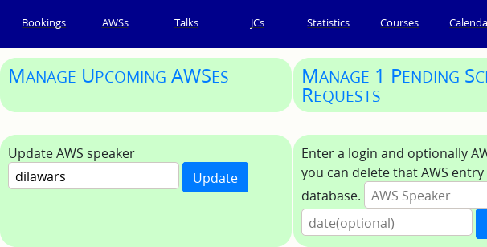
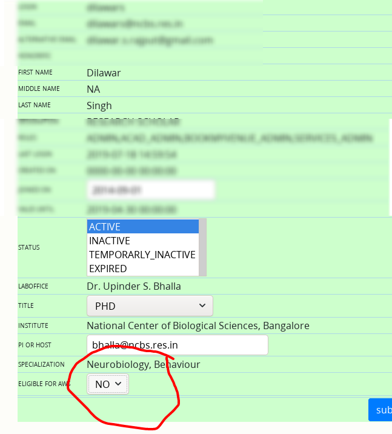

## FAQ

To reach Academic Admin page.  ==__My Home__ &rarr; __Academic Admin__==

{:style="width:60%"}

As you can see, there is a lot you can do. In all of the FAQs below, I am going
to assume that you are on this page.

### AWS related

??? question "How do I add someone to AWS roster?"

    You should know the login id of user. If you their email id then drop the
    `@ncbs.res.in` or `@instem.res.in` part and you have the login id. Submit
    this login id in __Update AWS speaker__ field as shown below and click on
    ==__Update__== button.

    

    You will be presented with a table where you can edit profile of this user.
    Set `ELIGIBLE FOR AWS` to `YES`.

    

???+ question "Where I can see the AWS roster?"

    

    You can see list of AWS speakers. They are arranged by __Faculty wise__ and
    __TCM wise__.

