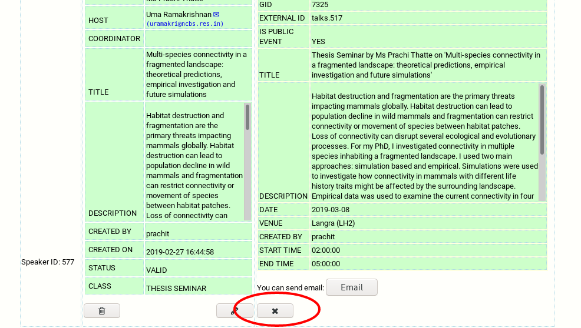
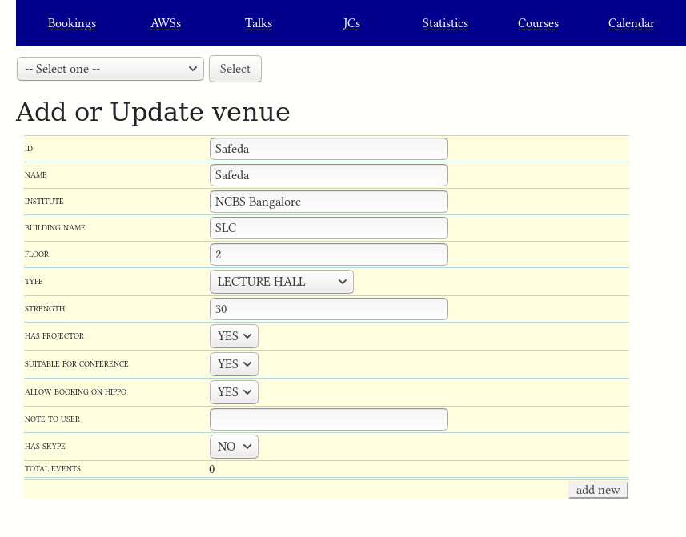
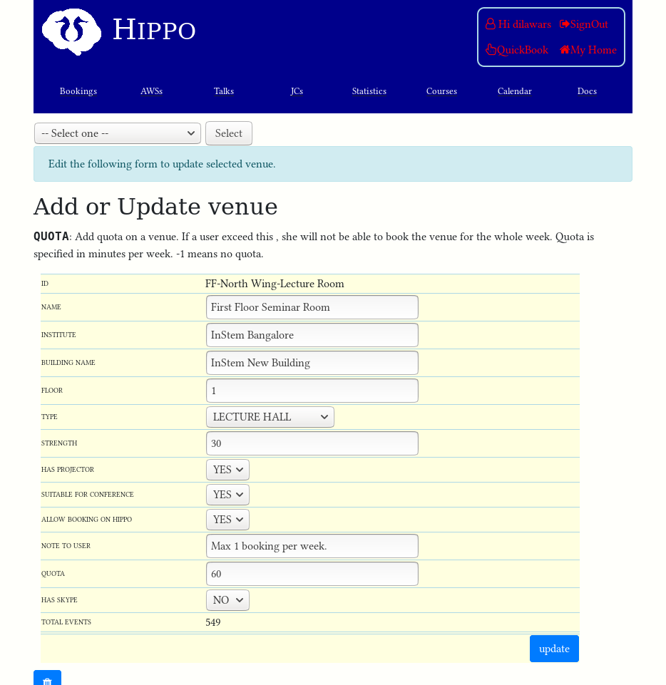
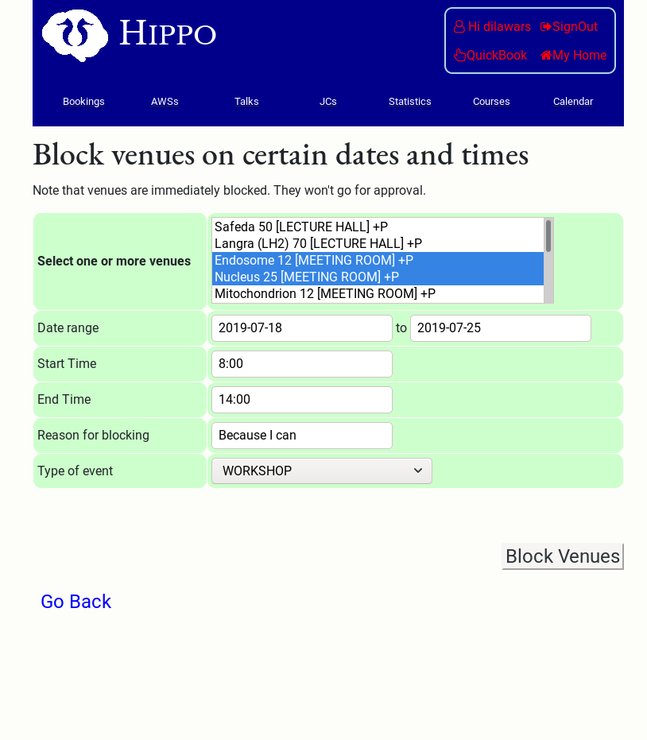

I am going to assume that you are on __BookMyVenue Admin__ page. To reach to
this page, ==_My Home_ (top right corner) &rarr;  _BookMyVenue Admin_==.

{: style="width:60%"}

# Manage bookings

??? optional-class "Cancel a booked event"
    Go to ==_Home Page -> Academic Admin -> Manage talks/seminar_==.

    {: style="width:60%"}

    Then search for talk you are looking for. In front of the talk, you will
    find the booking.

    There is ==__Cancel__== button to cancel the booked event.

    {: style="width:60%"}

    After the booking is cancelled, a new booking request can be created
    by clicking on button with calendar icon. The user can also create a fresh
    booking request by visiting appropriate links related to `Public
    Talks/Seminars`.
    
# Manage venues

For the following tasks, you must be at 
==__My Home__ &rarr; __BookMyVenue Admin__ &rarr; __Manage Venues__==
page.

??? optional-class "How do I add a new venue?"
    ==__My Home__ &rarr; __BookMyVenue Admin__ &rarr; __Manage Venues__==

    To add a new venue, fill the form. In the example below, I am adding a new
    venue called `Safeda`. 

    In the `ID` field, do not use any space.

    Press ==__add new__== button when you are done. The new venue will apear in
    the list of venues below this form (not shown in the image below).
     
    {: style="width:60%"}

??? optional-class "How do I edit a venue?"

    ==__My Home__ &rarr; __BookMyVenue Admin__ &rarr; __Manage Venues__==

    To edit an existing venue, select the venue from the drop down list and
    press ==__Select__==. The form will be filled by old value. Edit these
    values and press ==__update__== button.

    In the example below, I selected __FF-North Wing-Lecture Room__ venue from
    the dropdown list and pressed ==__Select__== (this step is not shown in
    figure below). I was presented the following
    form with old values. Here I am adding `NOTE TO USER` and adding `QUOTA`.

    {: style="width:60%"}

    Here is table of not-so-obvious options.

    - `ALLOW BOOKING ON HIPPO`: `NO` to disable booking by common pool.  Admin
      can still book this venue.
    - `NOTE TO USER`: Show extra information to user e.g., `Do not book in night`
    - `QUOTA`: Set quota on venue in minutes per week i.e.  user can not book it
      for more than this duration within a week. In the example above, no one
      can book this venue for more than 60 minutes per week. __Set this to -1 to
      remove quota__.

??? optional-class "How to I restrict booking on a venue?"
    There is only one option available for you. That is `QUOTA` option in venue.
    When `QUOTA` is set to `-1`, there is no restriction on the venue. Set it to
    non-zero positive venue to restrict the booking.

    If `QUOTA` is set to `x` then no one can book this venue for more than `x`
    minutes in a week. 

    !!! note "Potential misuse"
        
        Lets assume that you have enabled quota on a venue of 60 minutes. I can
        book this venue first time for 59 minutes. This way I could create
        another booking since 59 minutes is still less than maximum quota of 60
        minutes. Currently there is no protection from this trick!

??? optional-class "How do I block a venue?"
    In your admin page (i.e., ==_Home -> BookMyVenue Admin_==), you will find link
    ==__Block Venues__==. Click on it and you will be presented a form.

    Select multiple venues (press down _Ctrl_ key), select start and end dates
    and start and end times. Select a reason for blocking the venue and pick the
    type of event for which you are blocking this venue. In the example below,
    I've slected type `WORKSHOP` and very unhelpful message for reason. 

    {: style="width:60%"}

    Note that venues will be blocked immediately. No need for approval. Any
    booking made on these venues will be cancelled for the blocking period. The
    booking party may get an email that their booking is cancelled by admin (not
    sure about it!).

