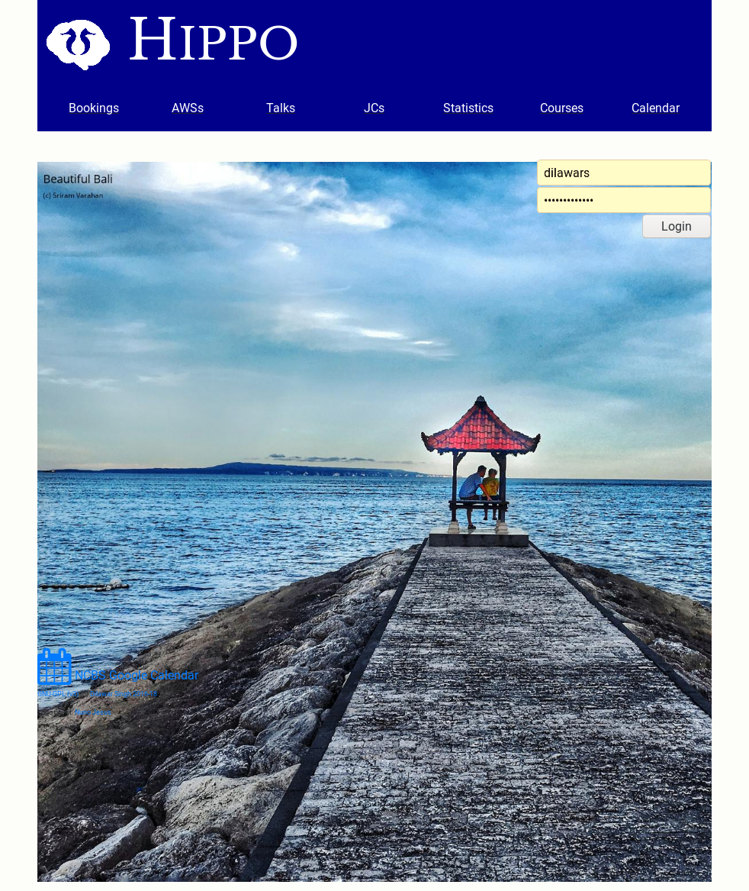

Welcome to the [NCBS’s Hippo](https://ncbs.res.in/hippo).
!!! information "Android App"
    An android app is available. [Get is from
    playstore](https://play.google.com/store/apps/details?id=com.dilawar.hippo&hl=en_IN)

Hippo manages venues in NCBS/InStem. Schedule AWSs, Journal Clubs, and it can do
much more. 

{: style="width:90%"}

Use your NCBS/InStem/CCAMP login id to login.

!!! note "First time login"
    You will be taken to a page to review your
    profile. Kindly review/edit your details. If you are suppose to give Annual
    Work Seminar (==AWS==), you must double check all entries. In case of
    discrepency, write email to [Academic
    Office](mailto:acadoffice@ncbs.res.in).

Please visit [User Manual](user_manual) for more details.

## Credits

- NCBS IT Dept for providing servers.
- Nuno Jesus for logo.
- Android App: Sweety Meel for background image.
