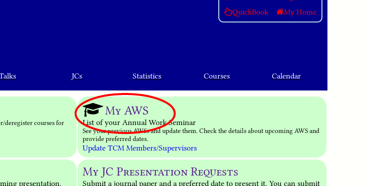
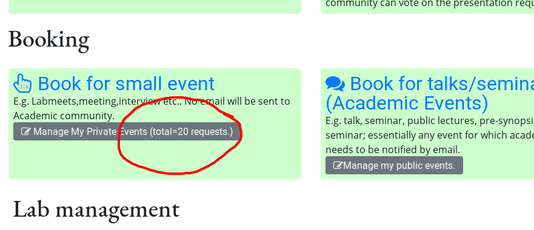
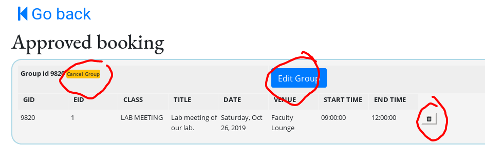

==This is a work in progress. If you want to correct a mistake or add some material, feel free to edit the page.==

## Login 

To login, use your NCBS, InStem, or CCAMP login id and password. Hippo accepts
usernames/password associated with `intranet` and `webmail` accounts. If you are using
`webmail` credentials, the login will be slow. We recommend that you use your
[intranet](http://intranet.ncbs.res.in/user){target=blank} credentials.

!!! note "First time login"
    You will be taken to a page to review your
    profile. Kindly review/edit your details. If you are suppose to give Annual
    Work Seminar (==AWS==), you must double check all entries. In case of
    discrepency, write email to [Academic
    Office](mailto:acadoffice@ncbs.res.in).

## FAQ 

??? optional-class "How to create a general booking request?"

    Click on ==**QuickBook**== at the top-right corner of the page. 

    You will be asked for date, start time, and end time. And other optional
    information. Click on ==__Show Available Venues__== to see the available
    venues.

    {: style="width:60%"}

    To book your venue, press ==__Book__== button below your venue. And you will be
    presented with a form.

    Please make sure you fill it under the right `CLASS` (e.g. `THESIS SEMINAR`,
    `LAB MEETING`, `TALK` etc.).  Once a request is submitted, your slot/venue
    is blocked and an email is sent your way. 

    !!! note "Recurrent Event"
        To make recurrent booking (maximum for 6 months), select appropriate
        days in __select days__ list. To limit your booking to some weeks such
        as first and third of every month, select those weeks (==Hold down
        `Ctrl` keys when selecting multiple entries.==).

        Don't worry, you can always delete your booking requests in case of
        error.

    {: style="width:60%"}

    !!! info "Emails in spam"
        If you are importing work emails into other email accounts such as
        gmail, please check your spam folder.

    You will receive confirmation/rejection email after approval/disapproval.
    You will receive an email alert to renew your booking, 5 to 7 days in
    advance before your last event expires.

??? optional-class "I need to change a confirmed booking (of a public Talks/Seminar)?"

    If the talk is already confirmed, then you need to contact academic admin or
    deans office to cancel it. If not, then you need to cancel pending request.

??? optional-class "How do I upload my AWS abstract?"
    Click on ==__My AWS__== link in your home page. If you cant’t find this link
    that means you are not eligible for AWS. Please contact academic office if
    you are (why would you be reading this otherwise!).

     

    Click on it!

    If you haven’t acknowledged the AWS schedule yet, you will see a button
    ==__Acknowledge AWS__==. Click it. After acknowledging the AWS, you will see
    a table of your AWS entry.  Press ==__Edit__== button below it.

    

    Clicking on ==Edit== button will take to you a form. Fill it and ==Submit==.
    Read the instructions at the top of the page. If you need help, do write to
    [Academic Office](mainto:acadoffice@ncbs.res.in). 

    After successful upload, you can see your abstract
    [here](https://ncbs.res.in/hippo/info/aws). Select the appropriate date.

??? optional-class "How do I book my thesis seminar?"

    See the item just below. While booking, select the talk `CLASS` to `THESIS
    SEMINAR`.

??? optional-class "How to book a public talk, lecture or seminar?"

    !!! info 
        Keep the photo and email id of speaker handy. You can continue without them but
        they are very useful for preparing documents. We strongly recommend that you
        arrange photo and email id of speaker. Email of speaker is never publicly displayed. 

    In your home page after login, click on ==__Book for talk/seminar etc.
    (Academic Events)__== and fill details.

    First section is for speaker, second is for talk. Third (optional) contains
    scheduling information. 

    If there is already some event on your selected date/venue, booking will be
    ignored but talk will be registered. You can schedule it later by visiting
    ==__Manage my public events__== link.  If the venue is available on chosen
    date and time, both talk and venue will be booked pending approval. After
    approval, you can see your event
    [here](https://ncbs.res.in/hippo/info/talks). 

    It will also appear on calendar and emails will be sent to appropriate
    mailing lists at appropriate times. Morning 8am is the usual time when
    automatic email is sent.

??? optional-class "Editing/updating/scheduling talks?"

    Go to your home page, and click on ==__Manage my public events__==. You will
    see all upcoming talks registered by you. You can click on ==__Edit__==
    button to edit the description and title.  If it is not already scheduled,
    you can schedule it by clicking on ==__Schedule__== button.

??? optional-class "How to cancel or edit booking request/event?"

    To edit or cancel a request or a confirmed booking, click 'My Home' (on top
    right corner box) then on 'Manage My Private Events'.

    {: style="width:60%"}

    All of your bookings should be visible on this page. To cancel a request or
    a confirmed booking, click on the button infront of a particular row. You
    can also modify/cancel the whole group (recurrent bookings).

    {: style="width:60%"}

